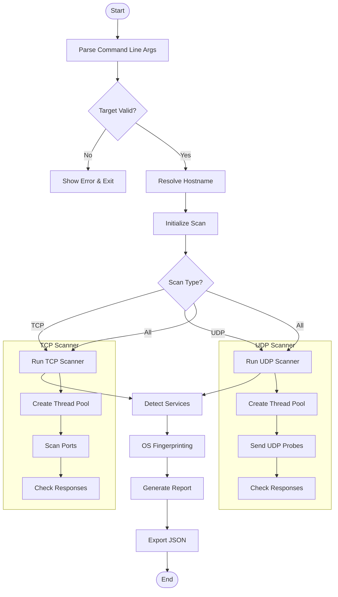

# custom-port-scan
Python based port scanner featuring multi-threaded TCP/UDP scans, OS detection, service versioning, and JSON reporting

# Features
- **Multi-protocol scanning**: TCP and UDP port scanning
- **Advanced detection**:
  - OS fingerprinting via TCP/IP stack analysis
  - Service version detection (banner grabbing)
- **Efficient scanning**:
  - Multi-threaded implementation
  - Customizable timeout settings
- **Reporting**:
  - JSON export for easy integration with other tools
  - Console output with color highlighting (optional)
- **Modular architecture**:
  - Separated components for easy maintenance/extension
  - Well-documented code

# Installation
1. Clone the repository
2. Install dependencies 
```
pip install -r requirements.txt
```
Note: On Linux you may need to install libpcap:
```
sudo apt-get install libpcap-dev  # Debian/Ubuntu
```

# Usage
Basic scan (TCP Ports 1-1024)
```
python main.py example.com
```
Advanced scan (UDP top 100 ports):
```
python main.py example.com -p common -t udp -o scan_results.json
```

# Full list of parameters

usage: main.py [-h] [-p PORTS] [-t {tcp, udp, all}] [-o OUTPUT] [-- threads THREADS] target

positional arguments:
  target                Target IP address or hostname

optional arguments:<br>
  -h, --help: show this help message and exit<br>
  -p PORTS, --ports PORTS Port range (e.g., 1-100) or 'common' (default: common)<br>
  -t {tcp,udp,all}, --type {tcp,udp,all} Scan type (default: tcp)<br>
  -o OUTPUT, --output OUTPUT: Output JSON file name<br>
  --threads THREADS: Number of threads (default: 100)<br>

# Ethical Considerations
Important: This tool should only be used:
- On networks you own
- With explicit permission from the network owner
- For legitimate security assessments

<b>Unauthorized scanning may violate laws and network policies.</b>


